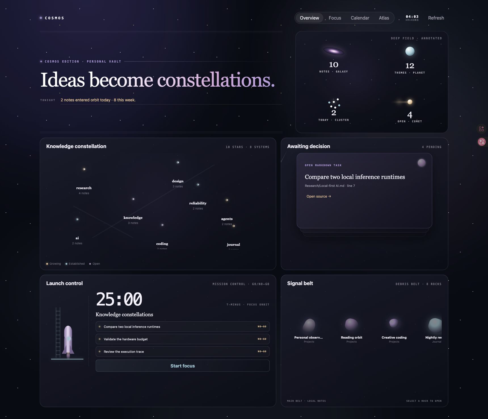
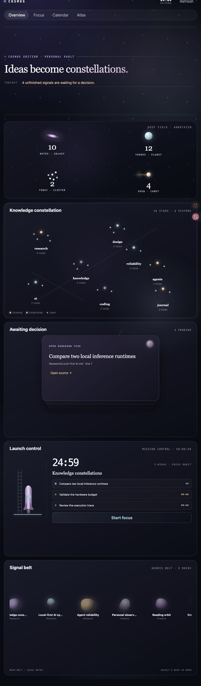
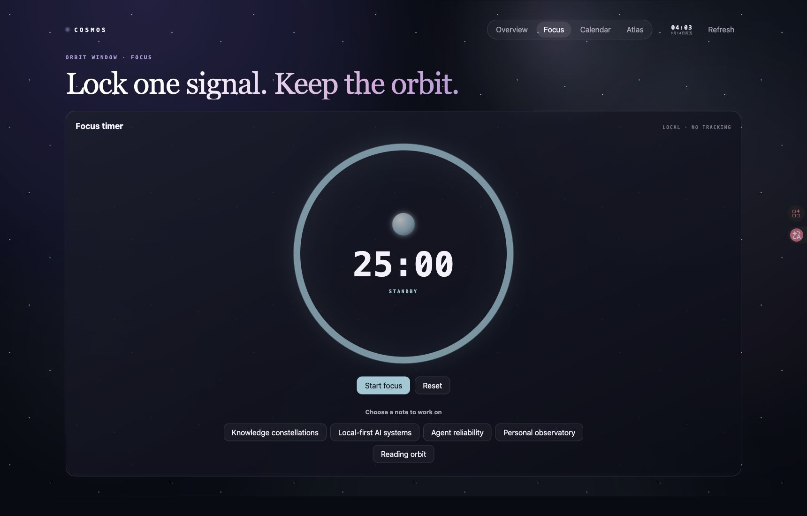
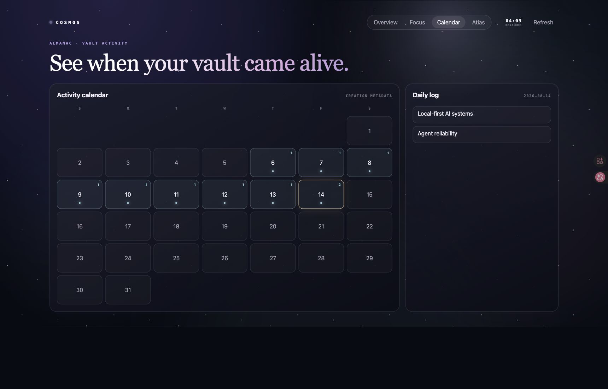
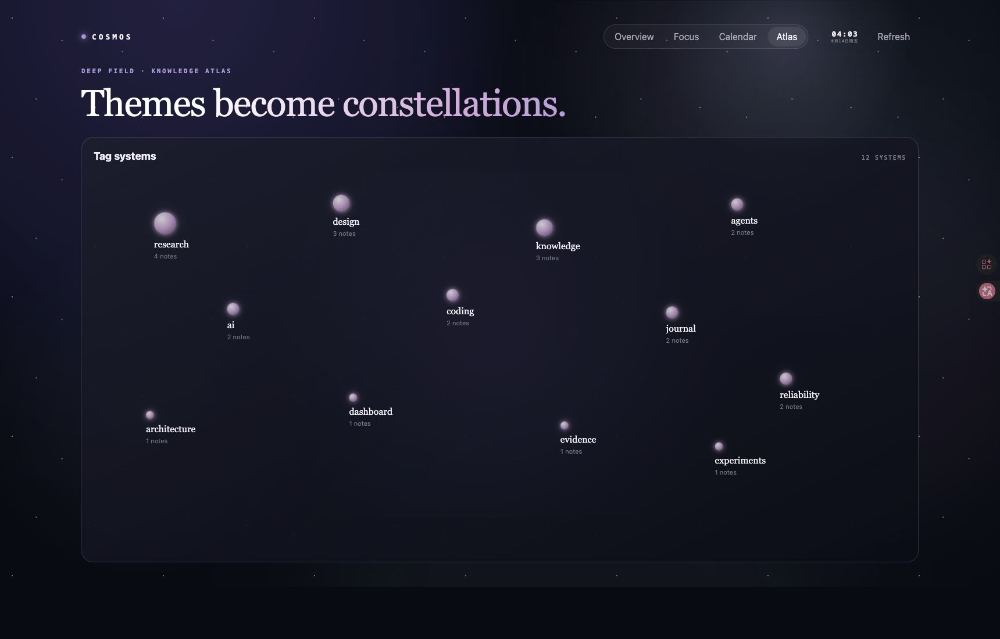

<div align="center">

# Cosmos Homepage

### Your ideas have an orbit.

A calm, interactive Obsidian homepage for seeing what is alive in your vault—recent notes, unfinished work, creation activity, focus, and recurring themes.

[**Add to Obsidian**](obsidian://show-plugin?id=cosmos-homepage) · [Community listing](https://community.obsidian.md/plugins/cosmos-homepage) · [Latest release](https://github.com/borrasindira97-star/cosmos-homepage/releases/latest)

</div>



Cosmos Homepage turns an ordinary vault into a personal knowledge observatory. It does not ask you to reorganize your folders or adopt a new workflow. Open it and the structure already present in your notes becomes visible: what changed today, what still needs attention, when your vault was active, and which ideas keep returning.

It is local, read-only, and ready to use without Dataview, an account, an AI service, or a special folder structure.

> The screenshots below use synthetic demo notes. Cosmos reads only your own local vault when installed.

## One homepage, four ways to see your vault

### Overview — a complete knowledge observatory

The Cosmos Edition overview combines five distinct instruments without creating a second database:

- **Deep field** shows honest note, theme, daily, and unfinished-task counts.
- **Knowledge constellation** turns your most-used tags into connected, breathing star systems.
- **Awaiting decision** surfaces real unfinished Markdown tasks and opens the exact source line.
- **Launch control** combines a local focus timer with a lightweight GO/NO-GO checklist.
- **Signal belt** keeps recent and changed notes moving through a selectable debris field.

The pointer carries a soft light source across the homepage; stars breathe together, meteors cross the decision deck, the rocket responds to readiness, and the signal belt pauses when you inspect it. Motion can be disabled without losing information.

<p align="center"></p>

### Focus orbit — give one idea uninterrupted time

Start a configurable local focus session beside the notes you were already working with. The timer stays session-local: no tracking account, no telemetry, and no writes added to your notes.



### Activity calendar — see when your vault came alive

Glowing dates reveal days with created notes. Select a date to see its daily log, then open the real Markdown file. Frontmatter dates are respected when present; otherwise Cosmos uses the creation time provided by Obsidian.



### Knowledge atlas — recurring themes become constellations

Your most-used tags become an interactive star system. Brighter systems represent themes with more notes. Select a star to open a real note from that theme and continue exploring from the source.



## Why Cosmos feels different

- **Zero reorganization.** It works with the folders, notes, tags, frontmatter, and Markdown tasks you already have.
- **A view, not another database.** Every useful item leads back to a real note in your vault.
- **Calm by design.** The starfield has atmosphere without obscuring the information you came to see.
- **Local by default.** No network requests, accounts, telemetry, advertisements, or AI calls.
- **Read-only by design.** Cosmos does not edit notes, create files, or rewrite metadata.
- **Accessible motion.** Keyboard navigation, visible focus states, responsive layouts, honest empty states, and reduced-motion support are built in.

## Start in under a minute

1. Install **Cosmos Homepage** from Obsidian's Community plugins.
2. Select the sparkle icon in the ribbon, or run **Cosmos Homepage: Open homepage** from the command palette.
3. Move between **Overview**, **Focus**, **Calendar**, and **Atlas**.
4. Open **Settings → Cosmos Homepage** to choose your headline, focus duration, excluded folders, startup behavior, and motion preference.

Cosmos does not take over your workspace after installation. Enable **Open on startup** only if you want it to open automatically after Obsidian restores your workspace.

## What Cosmos reads

Cosmos uses metadata already indexed by Obsidian:

- file names and paths;
- creation and modification timestamps;
- tags;
- `created`, `created_at`, or `date` frontmatter;
- Markdown task positions needed to open the source line.

It does **not** scan note bodies to build the homepage. Obsidian's already-indexed task metadata supplies the unfinished-task labels and source positions; Cosmos does not open files to parse them. Excluded folders are never included in its projection; the defaults exclude `.trash` and `Templates`. Settings are stored through Obsidian's plugin data API.

## Honest limits

- Atlas stars represent shared tags, not semantic similarity.
- Calendar accuracy depends on available frontmatter or the file creation time reported by Obsidian.
- The focus timer is intentionally session-local and is not a time-tracking system.
- Version 1 has no network or AI integration. Future adapters, if added, will remain optional rather than silently changing the local-first baseline.

## Manual installation

1. Download `main.js`, `manifest.json`, and `styles.css` from the [latest release](https://github.com/borrasindira97-star/cosmos-homepage/releases/latest).
2. Put them in `<your-vault>/.obsidian/plugins/cosmos-homepage/`.
3. Reload Obsidian and enable **Cosmos Homepage** in Community plugins.

## Development

```bash
npm install
npm run release:verify
```

The release bundle is `main.js`; `manifest.json` and `styles.css` ship alongside it.

`npm run demo` starts the screenshot/visual-regression harness. It instantiates the production `CosmosHomepageView` with a synthetic metadata projection; it is not a separately maintained mock interface.

## License

[MIT](./LICENSE)
